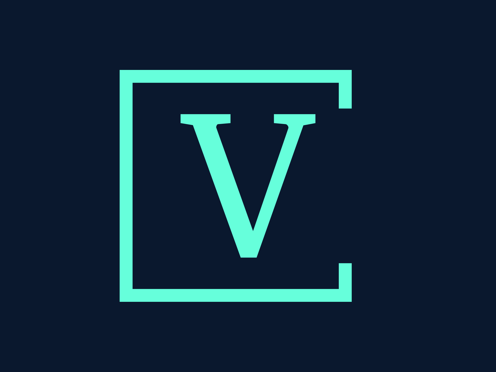

# Portfolio

[![LinkedIn][linkedin-shield]][linkedin-url]

 

  

  

	This is my portfolio website created with Astro and React.
     
     
    <a href="https://v-mokhun.com">View Site</a>
    ·
    <a href="https://github.com/v-mokhun/portfolio/issues">Report Bug</a>
  

## About The Project

[![Home Screenshot][home]](https://v-mokhun.com)

The site was created to showcase my skills and projects as well as to provide a way to contact me.

It was built using Astro and React.js. It uses SSR (Api routes specifically) in contact form for sending emails if you want to contact me. For styling TailwindCSS and Shadcnui are used, site is hosted on Vercel but has a custom domain.

There also is a language switcher that changes the language of the site: English, Polish, Ukrainian and Russian are supported. The language is saved in the local storage and is used on the next visit.

The website also implements a theme switcher that changes the theme of the site: light and dark are supported.

The website is fully responsive and works on all screen sizes.

(<a href="#portfolio">back to top</a>)

### Built With

- [![Astro][Astro]][Astro-url] With [![React.js][React.js]][React-url] as a Frontend Framework

- [![TypeScript][TypeScript.org]][TypeScript-url] For Type Safety

- [![TailwindCSS][TailwindCSS.com]][TailwindCSS-url] With [![RadixUI][RadixUI.com]][RadixUI-url] For UI Components

- [![ReactHookForm][ReactHookForm.com]][ReactHookForm-url] For Form Handling

- [![Zod][Zod.dev]][Zod-url] For Form Validation

(<a href="#portfolio">back to top</a>)

## Contact

[Telegram](https://t.me/v_mokhun)

[LinkedIn](https://www.linkedin.com/in/v-mokhun/)

Project Link: [https://v-mokhun.com](https://v-mokhun.com)

(<a href="#portfolio">back to top</a>)

[linkedin-shield]: https://img.shields.io/badge/-LinkedIn-black.svg?style=for-the-badge&logo=linkedin&colorB=555
[linkedin-url]: https://www.linkedin.com/in/v-mokhun/
[home]: readme-images/home.png
[Astro]: https://img.shields.io/badge/-Astro-000000?logo=astro&logoColor=white&style=for-the-badge
[Astro-url]: https://astro.build/
[React.js]: https://img.shields.io/badge/-ReactJs-61DAFB?logo=react&logoColor=white&style=for-the-badge
[React-url]: https://reactjs.org/
[ReactHookForm.com]: https://img.shields.io/badge/React%20Hook%20Form-%23EC5990.svg?style=for-the-badge&logo=reacthookform&logoColor=white
[ReactHookForm-url]: https://react-hook-form.com/
[TailwindCSS.com]: https://img.shields.io/badge/tailwindcss-%2338B2AC.svg?style=for-the-badge&logo=tailwind-css&logoColor=white
[TailwindCSS-url]: https://tailwindcss.com/
[TypeScript.org]: https://img.shields.io/badge/typescript-%23007ACC.svg?style=for-the-badge&logo=typescript&logoColor=white
[TypeScript-url]: https://www.typescriptlang.org/
[RadixUI.com]: https://img.shields.io/static/v1?style=for-the-badge&message=Radix+UI&color=161618&logo=Radix+UI&logoColor=FFFFFF&label=
[RadixUI-url]: https://www.radix-ui.com/
[Zod.dev]: https://img.shields.io/static/v1?style=for-the-badge&message=Zod&color=3E67B1&logo=Zod&logoColor=FFFFFF&label=
[Zod-url]: https://zod.dev/
