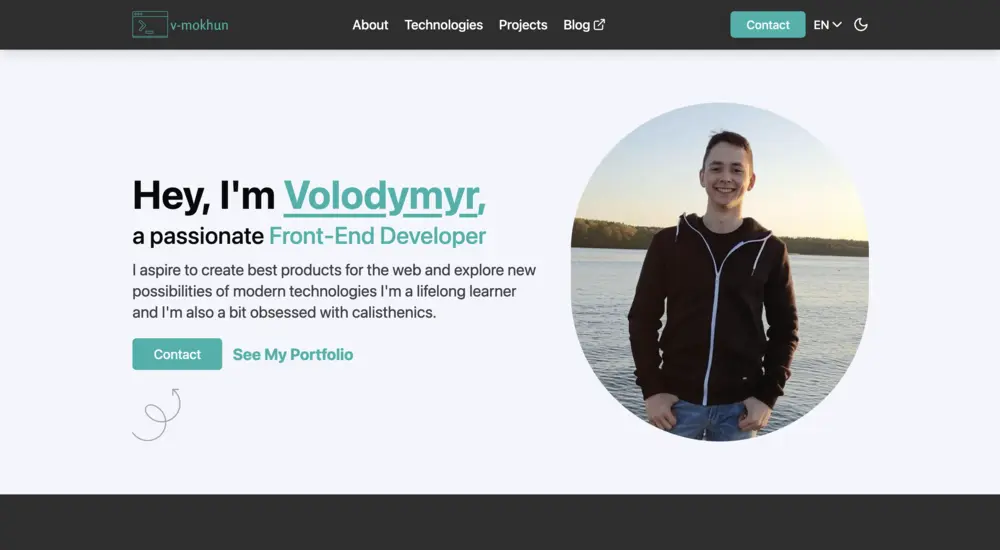

During the last few weeks, I've been working on redesigning my website. I wanted to share the process I followed and the tools I used.

If you don't know how my website looked before, here is a screenshot:

You can also check the live version at [v1.v-mokhun.com](https://v1.v-mokhun.com).

### What I didn't like

I can't say that I don't like the previous design, it's just that I thought it lacks good color scheme, more animations, and content organization. It is alright, and I didn't do much research on the design before implementing it.

A good thing, though, is I was able to avoid a complete rewrite of the functionality. I hardly changed the content of projects section and I left contact form as it was.

### Design

Firstly, I'd like to thank and recommend the [Syntax.fm podcast](https://syntax.fm) where in quite a few episodes I learned much about design principles, implementing good dark mode, typography, and where to find inspiration.

I finally decided to use **Figma** before actually coding the design. Given that I haven't used it before, after watching a half-hour tutorial, I was able to wrap my head around it (well, somewhat). I looked for good portfolio websites online, took something from here and there, and here we are.

Oh, and if you're curious, I created the logo on [this logo generator](https://app.logo.com), it's good if you don't want to draw anything yourself.

For a portfolio website content really matters, so I tried to make it as clear and concise as possible. I incorporated personal thoughts and AI to get the "best of both worlds".

### Development

As I've mentioned, I didn't change much in the functionality. I really like the particles effect in the hero and skills sections, kind of neat. Also, hiding header on scroll down and showing it on scroll up is a nice touch.

Animations are done with [React Spring](https://www.react-spring.io), because I didn't need anything complex and from my research, react-spring is a more lightweight solution than **Framer Motion**. I'm also excited about the _Ripple Effect_ on the buttons, I probably spent good 2 hours on it.

Well, there's really nothing more to say about development.

### Thoughts

I hope this redesign will help me secure a **summer internship** or even my **first job**. I've been applying to various positions for half a year now with no luck, but that's a story for another time.

If you have any questions or suggestions, I'd be happy to talk to you. My [LinkedIn](https://www.linkedin.com/in/v-mokhun/) and [Twitter](https://twitter.com/v_mokhun) are always open.
