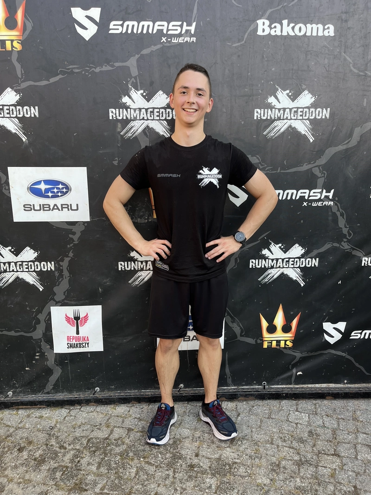

I was never keen on running (this was my fourth time starting and quitting), but sometimes you do things you don't like and push yourself out of your comfort zone. Well, I did that. One month into running, I signed up for an obstacle run to keep myself motivated, so to speak.

## My Physical Activities

I love working out, really. It's a part of who I am. When a few days pass without any kind of physical activity, I kinda become depressed, exhausted, sleepy—things like that. (It's both a blessing and a curse, because I HAVE TO work out to function normally.) I mainly do **calisthenics** — from basic exercises like pull-ups and dips to more advanced moves like handstands and muscle-ups. And no, I don't skip leg day :)

Oh, I also stretch every day just to feel "normal." But, as if that's not enough, I realized I wasn't doing well when it came to cardio and exercises focused on the heart. Even during my regular workouts, I noticed I was running out of breath quickly. That's why I decided to take up running seriously, even though running and I don't go well together (speaking from a quitter's experience).

## Running Beginner

After watching a few videos and reflecting on all the times I'd started and stopped running, I decided to take things slowly and add some variety to my plan. I settled on running three times per week: one casual run (20–30 minutes), one "pyramid run" where you run fast (well, my version of fast) for 1–2–3–2–1 minutes and follow each step with an equal amount of slow running, and one long run (40–50 minutes).

Still, I wanted to do something I hadn't done before to keep myself in shape and have some sort of "motivation" (although I don't like that word — I'm more of a discipline fan). So, I signed up for an obstacle race ([Runmageddon](https://www.runmageddon.pl/), to be specific) scheduled for three weeks later.

I admit, I didn’t pick a very ambitious distance — 3 kilometers and 15 obstacles doesn’t sound like much — but it’s a start. If it were easy, I'd be fired up for the next race and just keep the ball rolling.

## Preparation and Race Day

As for preparation, I stuck to my routine of casual, pyramid, and long runs. At least I didn’t skip any, although I gotta admit, one time the temptation was strong. Was it my discipline or the fear of not finishing the race? Who knows.

On race day, I got up early, traveled 2.5 hours by train to **Gdańsk**, and, with three hours to spare, walked around a park, read a book, and gathered my thoughts. I wasn’t nervous or anything — since it was my first race, I didn’t really know what to expect.

When I arrived at the event, I saw a few obstacles already set up, and lots of people walking, chatting, and warming up (some had already finished their races since I signed up for 4 PM, and the event started in the morning). It felt great, and I hadn’t even started running yet.

During the run, it was a mix between "Well, I thought that would be harder" and "Just breathe and keep your legs moving — you’re close." My running form wasn’t the best, but it would definitely have been worse if I hadn’t started running 1.5 months earlier. As for the obstacles, I had no idea what to expect, but I think I managed pretty well. My calisthenics background helped immensely.

The most memorable and refreshing moment came near the finish line. I didn’t have to run anymore because the last section was just five obstacles in a row. But first, I had to dive into ice-filled water, and when I came out of that pool, I felt fully reborn. The effect was so powerful that I thought I could run another 3 kilometers!

If you’re curious, my final time was 38:08, which I think is pretty good for my first race. Afterward, I knew I LOVED these kinds of events. Running combined with calisthenics-like challenges? Hell, I’m in!

## Keep Pushing

I’m writing this post the day after the race. I’m recovering a bit, but I’m going to keep running and improving my fitness for the next race, which I plan to be 6 kilometers with 30 obstacles. It sounds tough — and it is — but after yesterday’s experience, I know it’ll be worth it 100%.

Keep pushing!
